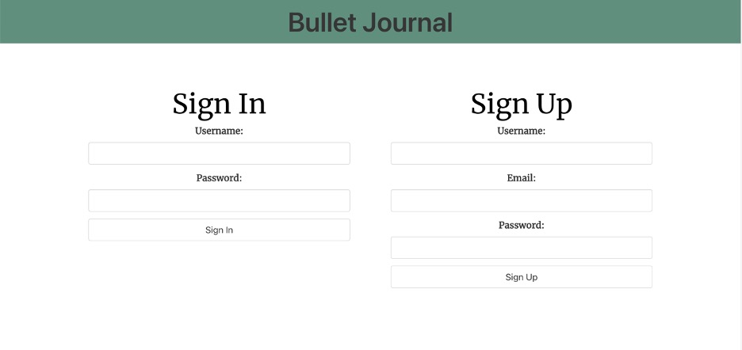
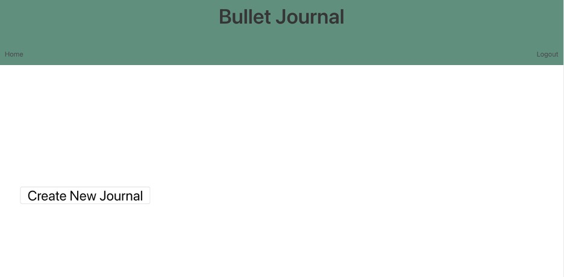
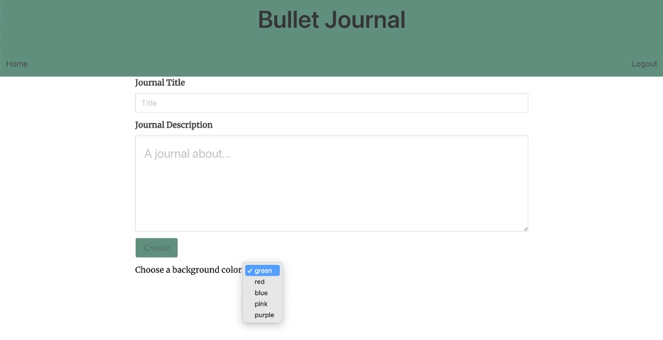
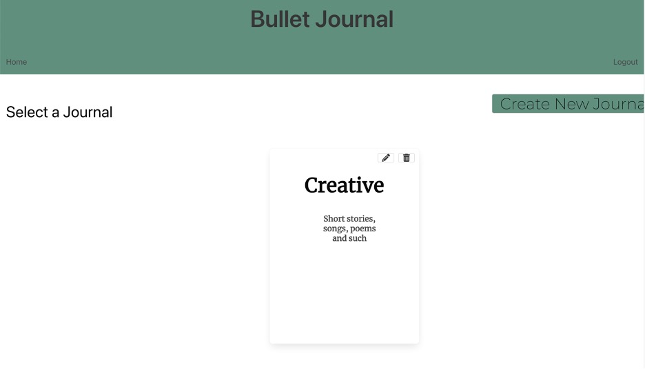
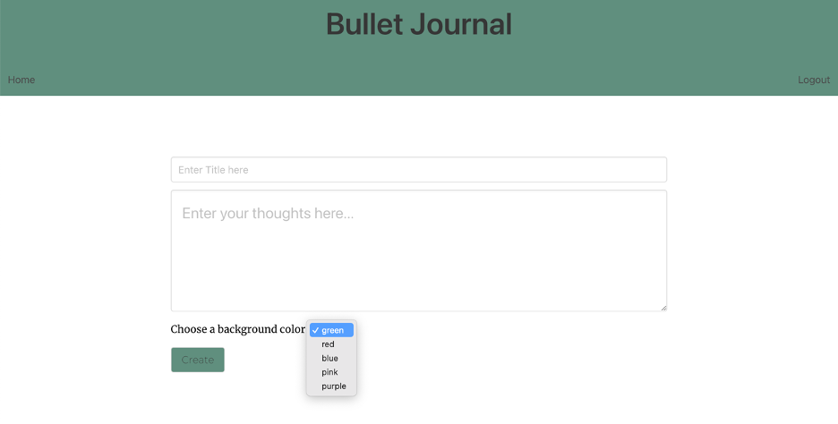
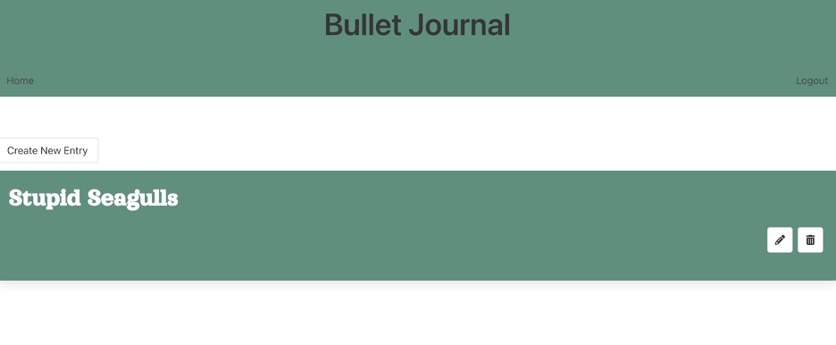

# bullet-journal
## Table of Contents
- [bullet-journal](#bullet-journal)
  - [Table of Contents](#table-of-contents)
  - [Technology Used](#technology-used)
  - [Description](#description)
  - [Usage](#usage)
  - [Learning Points](#learning-points)
  - [Author Info](#author-info)
    - [Ryan Moscoe](#ryan-moscoe)
    - [Megan Ellman](#megan-ellman)
    - [Solomon Santos](#solomon-santos)
  - [License](#license)

 

## Technology Used

| Technology Used         | Resource URL           | 
| ------------- |:-------------:| 
| CSS     | [https://developer.mozilla.org/en-US/docs/Web/CSS](https://developer.mozilla.org/en-US/docs/Web/CSS)      |   
| JavaScript | [https://developer.mozilla.org/en-US/docs/Web/JavaScript](https://developer.mozilla.org/en-US/docs/Web/JavaScript)     |    
| Node.js | [https://nodejs.org/en/](https://nodejs.org/en/) |
| MySQL | [https://www.mysql.com/](https://www.mysql.com/)
| Sequelize | [https://sequelize.org/](https://sequelize.org/)
| Express | [https://expressjs.com/](https://expressjs.com/)
| Express-Handlebars | [https://www.npmjs.com/package/express-handlebars](https://www.npmjs.com/package/express-handlebars)
| Path | [https://nodejs.org/docs/latest/api/path.html](https://nodejs.org/docs/latest/api/path.html)
| Express-Session | [https://www.npmjs.com/package/express-session](https://www.npmjs.com/package/express-session)
| Connect-Session-Sequelize | [https://www.npmjs.com/package/connect-session-sequelize](https://www.npmjs.com/package/connect-session-sequelize)
| Dotenv | [https://www.npmjs.com/package/dotenv](https://www.npmjs.com/package/dotenv)
| Bulma | [https://bulma.io/](https://bulma.io/)
| Google Fonts | [https://fonts.google.com/](https://fonts.google.com/)
| Font Awesome | [https://fontawesome.com/](https://fontawesome.com/)
| Bcrypt | [https://www.npmjs.com/package/bcrypt](https://www.npmjs.com/package/bcrypt)
 

## Description 

[Visit the Deployed Site](https://bullet-journal.herokuapp.com/)

Bullet Journal allows users to organize their thoughts and feelings by creating an unlimited number of journals, which can each contain an unlimited number of entries. That way, users can organize journals by topic, time period, or any other category they desire. Journals and entries can also be customized with a user's chosen color for color-coding or just aesthetic preference. Users can edit or delete journals or individual entries at any time.

 

## Usage 

The homepage offers the options to sign up for an account or log into an existing account. Sign up with a username, email address, and password at least 8 characters long. On future visits, you can log in with just your username and password.

After creating an account or logging in, you are taken to your Dashboard. You now have a navigation bar with options to return to the Home (Dashboard) page from anywhere in the application or log out. As a new user, your first step is to create a journal.

Clicking the Create New Journal button opens the Create Journal page, where you can give your journal a title, a description, and a background color of your choice. Click Create to submit your choices.

After creating at least one journal, your Dashboard will show your existing journals (see below). From the Dashboard, you can now create another journal, view the details for an existing journal, edit a journal (title, description, and background color), or delete a journal.

Clicking a journal opens the Journal page, where you can view a list of the entries in the journal. When you first create a journal, it has no entries, so you are prompted to create one.

Clicking the Create New Entry button opens a form where you can enter a title and content for your entry and select a background color.

After you create at least one entry, your Journal page shows a list of entries. Click one of these entries to view the details or click the Create New Entry button to add an entry.

 

## Learning Points 

* Using Bcrypt to store passwords securely
* Adding hooks to models in Sequelize
* How to differentiate between home routes and API routes
* How to creatively pass context to Express-Handlebars to dynamically control what gets rendered on a page

 

## Author Info

### Ryan Moscoe 

* [Portfolio](https://rmoscoe.github.io/portfolio/)
* [LinkedIn](https://www.linkedin.com/in/ryan-moscoe-8652973/)
* [Github](https://github.com/rmoscoe)

 

### Megan Ellman
* [LinkedIn](https://www.linkedin.com/in/megan-ellman/)
* [GitHub](https://github.com/megellman)
* [Portfolio](https://megellman.github.io/portfolio/)

 

### Solomon Santos
- [LinkedIn](https://www.linkedin.com/in/solomon-santos)
- [GitHub](https://www.github.com/captaiiinsolo)
- [Twitter](https://twitter.com/captaiiinsolo)

 

## License

[MIT License](https://choosealicense.com/licenses/mit/)